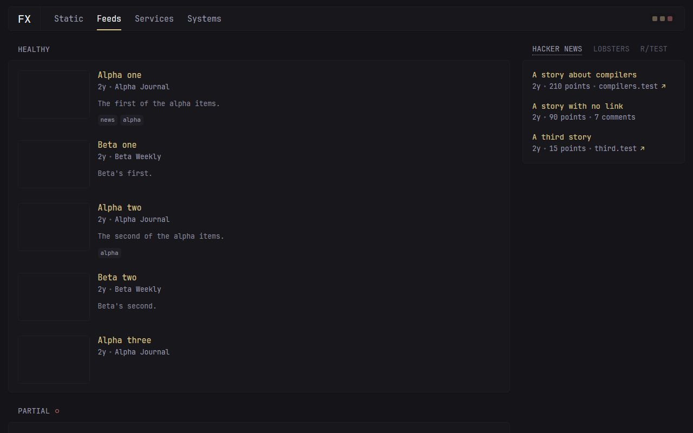

# glance-akka

A dashboard: it reads a configuration file, fills a set of pages with widgets that fetch
from feeds and services on their own schedules, draws the pages, and serves them.

A port of [glanceapp/glance](https://github.com/glanceapp/glance) onto **Akka**, built with
**Akka Specify**.



---

## Where it came from

glance is a self-hosted dashboard: you write one file listing what you want to see, and it
draws it on a page you leave open. It was ported to derive a specification format precise
enough to regenerate a system on a different stack — the port is the vehicle, the
specification is the deliverable.

This is the whole system rather than a part of it: every one of the twenty-nine kinds of
widget, every configuration directive, the command line, the login, the theme picker, the
static assets and the original's own pages.

The specifications the port was generated from are in
[TylerJewell/akka-specify-harness](https://github.com/TylerJewell/akka-specify-harness)
under `glance-port/`.

---

## glanceapp/glance → this port

📉 9,713 Go lines → **14,009 Java lines**<br>
📁 56 files → **112 files**<br>
🧩 29 kinds of widget → **29 kinds of widget**<br>
🎯 438 of 438 compared answers agree → **438 of 438**<br>
🖼️ 0 changed regions across four screens → **0**<br>
⚡ 389 → **562** microseconds to draw a page's contents<br>
👀 reload required to see a change → **7.7** milliseconds, ninety-fifth percentile<br>
🧪 3 tests → **141 tests**

Full method and the numbers that did *not* make this list:
[`bench/REPORT.md`](https://github.com/TylerJewell/akka-specify-harness/blob/main/glance-port/bench/REPORT.md).

---

## What it took to build

⏱️ **88.9 hours** from the first command to the published repository, **6.9** of them active<br>
💬 **1,977** exchanges with the model<br>
✍️ **1,647,676** tokens written by the model, **742,589,374** counting everything sent and re-sent<br>
🙋 **0** questions to a human<br>
🧪 **141** tests

```bash
python toolkit/tokens.py --port glance    # turns, tokens, elapsed and active time
```

The record of every question, and where the time went, is in
[`port-log/`](https://github.com/TylerJewell/akka-specify-harness/tree/main/port-log).

---

## What it does

From the specification:

- **The type of a widget decides everything else about it.** A widget with no type and a
  widget of a type nobody has heard of are each refused by name before any of its other
  settings is read.
- **A widget is refreshed only once its deadline has passed.** A deadline falling exactly
  on the instant being asked about has not passed yet, so nothing refreshes early.
- **Losing some of what a widget reads is not the same as losing all of it.** Some means
  the page still shows what came back, with a small mark in the heading; all means it keeps
  showing the last thing that arrived, with a larger one.
- **A widget that has ever had something to show never draws an error instead of it.** Only
  one that has never once succeeded is replaced by an error message.
- **A failed refresh is retried sooner than the ordinary schedule, and never later.** The
  wait grows one, four, nine, sixteen, twenty-five minutes and then stops growing, and any
  of those is skipped if the ordinary deadline would have come round first.
- **A page waits for every widget it refreshed.** They run at the same time, so one slow
  fetch delays the page by its own time rather than by everybody's added up.
- **A configuration is read once, with everything it points at pasted in.** Names of
  environment variables, of files under the secrets directory, and of files named by an
  environment variable are all replaced by what they hold, and a reference to something
  missing stops the read and says which one.
- **Every page is drawn by glance's own page files.** The same forty-four of them, run
  through an interpreter for the template language Go ships, so what comes out is the same
  bytes rather than a lookalike.
- **A signed-in visitor carries a token nobody else can write.** It holds the name, the
  expiry and a signature over both; changing any byte of it makes it unreadable, it lasts a
  fortnight, and it is replaced once a week is left on it.

---

## Design decisions

**Pushed, not asked for.** A page left open shows things that change without anybody
touching them, and asking the server again on a timer means a change waits for the timer.
The page holds one open connection and the server sends the whole page down it the moment
anything moves, so a change appears in about seven thousandths of a second instead of when
somebody presses reload.

**The original's own pages, not new ones.** Building replacement screens would make "does
it look the same" a question about somebody's taste rather than about the rebuild. This
ships glance's page files, its stylesheets and its scripts unchanged, with only the part
that fetches data rewritten — so the two can be compared side by side, and they come out
identical to the pixel.

**The template language is rebuilt rather than routed around.** The pages above are written
in the template language Go ships with, and nothing on this stack reads it — so the choice
was to translate forty-four files by hand or to write something that runs them. Writing the
interpreter is two thousand lines and keeps the files as they are, which is what lets the
two systems be compared byte for byte.

**The clock is handed in.** Working out when something is next due by looking at the wall
clock makes the answer depend on when you asked, which cannot be tested and cannot be
compared against another system. Every deadline here is worked out from an instant passed
in with the result, so the same inputs always give the same answer and both systems can be
put the same question at the same moment.

**Fetching happens outside the part that remembers.** The original does both in one go — it
downloads and updates the widget in the same function — and on this platform the part that
remembers is not allowed to wait on a network. So the download runs on its own and hands
the result over, which also makes its finishing time an input rather than something read
off the clock.

---

## Running it — the short path

You do not need Java, Maven, or the Akka CLI installed. Akka Specify installs them for you.

**1. Install Akka Specify** in Claude Code:

```
/plugin marketplace add akka/ai-marketplace
/plugin install akka@akka-ai-marketplace
```

Restart Claude Code when it asks.

**2. Give it this prompt:**

> Clone https://github.com/TylerJewell/glance-akka into a new directory and open it.
> Then run /akka:setup to install everything this project needs, and /akka:build to
> compile it, run the tests, and start it locally.

**3. Open** http://localhost:9154.

---

## Running it — the developer path

### Requirements

- Java 21 or newer
- Maven 3.9 or newer
- An Akka download token — run `akka code token` once

### Start the service

```bash
mvn compile
akka local run
```

The service starts on **port 9154** and serves the configuration named by `GLANCE_CONFIG`,
or the one shipped with it when that is unset.

### The command line

The same commands the original answers, run against the built classes:

```bash
mvn -q compile exec:java -Dexec.mainClass=io.akka.glance.cli.Main -Dexec.args="config:validate glance.yml"
```

| Command | What it does |
|---|---|
| `--version`, `-v`, `version` | Prints the build. |
| `config:validate <file>` | Reads the file with everything it includes and says why it is invalid, or nothing. |
| `config:print <file>` | Prints the file with its includes pasted in. |
| `password:hash <password>` | Prints a hash to put in a configuration. Refuses an empty password and one under six characters. |
| `secret:make` | Prints a new signing key. |
| `sensors:print` | Lists this machine's temperature sensors. |
| `mountpoint:info <path>` | Prints a path's filesystem kind and how full it is. |
| `diagnose` | Reports this machine and whether it can reach each of thirteen services. |

---

## Configuration

| Variable | Default | Notes |
|---|---|---|
| `GLANCE_CONFIG` | `glance.yml` beside the working directory | The configuration file to read at startup. |
| `GLANCE_CONFIG_API` | unset | `on` offers `PUT /api/config/` and `GET /api/config/`. Both answer `404` until it is set. |
| `GLANCE_ENDPOINT_*` | the service's own address | One per service a widget reads from — `GLANCE_ENDPOINT_GITHUB`, `GLANCE_ENDPOINT_REDDIT` and eleven more. Points a widget at a different server, which is how the comparison against the original feeds both sides the same bytes. |
| `akka.javasdk.dev-mode.http-port` | `9154` | In `src/main/resources/application.conf`. Where the pages are served. |

Everything else — pages, columns, widgets, the theme, the accounts, the branding, the
assets directory, the proxy — is in the configuration file, in the same shape the original
reads.

---

## Where it differs from glanceapp/glance

Everything not listed here behaves the same way on purpose, including the parts that look
like mistakes.

- **An open page updates itself.** glance fetches a page's contents once when the page
  loads and never again, so a change that happens on the server is invisible until somebody
  reloads. This port sends each new state down an open connection and redraws the page in
  place, because a dashboard is meant to be left open and a screen that is silently out of
  date is worse than one that is visibly loading.
- **What happens when the connection drops has an answer here and none there.** glance's
  page never holds a connection, so it never had to decide. This port sends the whole page
  in every frame rather than only what changed, so a page that comes back is correct
  immediately without being told what it missed — measured at just over half a second across
  three deliberate cuts.
- **Two things that are equal come back in a settled order.** glance sorts with a routine
  that does not promise to keep equal things in the order it found them, so two posts with
  the same score, two releases at the same instant or two containers with the same name may
  come out either way round between runs. This port's sorts keep the order things arrived
  in, because a page that rearranges itself for no reason is a page nobody can trust they
  are reading correctly.
- **A graph with nothing in it is drawn flat.** glance works out each bar's height against
  the tallest bar, and when every bar is zero it divides by zero and converts the result to
  a whole number, which the Go language leaves to whoever built the compiler. This port
  leaves every bar flat, because a graph with nothing in it has no shape to draw.
- **A configuration can arrive over the network as well as from a file.** glance reads a
  file and watches it, rebuilding itself half a second after any change. This port reads a
  file at startup and can also be given one over `PUT /api/config/`, because it is built to
  run where there is no file to watch; the route is offered only when the operator turns it
  on, and answers `404` until then.
- **The connection to reddit is opened the ordinary way.** glance shapes its handshake with
  reddit to look like a particular web browser's, because the plain one is refused on some
  networks. Java has no way to shape a handshake like that, so this port opens the
  connection the ordinary way. Everything above the handshake — the challenge, the shared
  cookie, the credentials, the addresses and the posts — is the original's, and was run
  against a server standing in for reddit; **against reddit itself it is not checked**.
- **How each widget behaves against the real service it reads from is not checked.** Every
  comparison in this port fetches from one server standing in for all of them, so what was
  compared is each system's handling of a reply rather than its handling of GitHub, reddit,
  Twitch, Docker Hub, Open-Meteo or Yahoo Finance as they actually answer today. Where a
  real service's replies are not the shape that server sends, both systems would be wrong
  the same way and the comparison would call that agreement.
- **How long it takes to start is not compared.** The original is one compiled program and
  starts in about six tenths of a second; this one starts a runtime under a virtual machine
  and the figure is not counted by the same rules, so no ratio between the two is quoted.
- **What either system does under load is not checked.** Every measurement here is one
  page at a time in one process. Nothing says what happens with a hundred pages open.

---

## Licence

glanceapp/glance is licensed under the GNU Affero General Public License v3.0, © Svilen
Markov and contributors. This port is a derived work: it ships the original's page files,
stylesheets, scripts, fonts and icons unchanged, and reimplements the rest of its behaviour.
See `ACKNOWLEDGEMENTS.md`.
