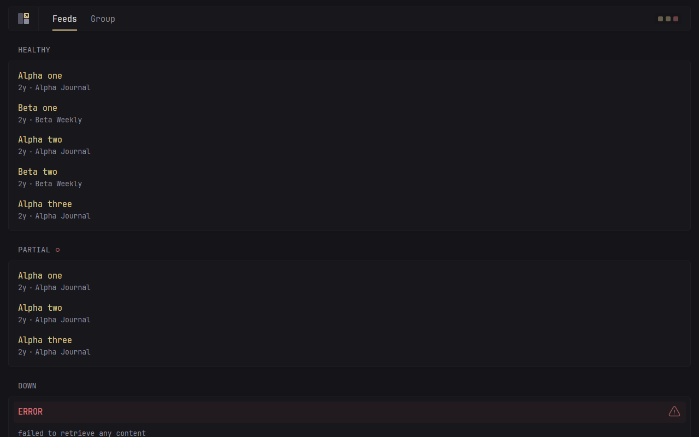

# glance-akka

A dashboard page that fetches feeds on a schedule, keeps what it fetched until it goes
stale, and keeps showing it when a feed stops answering.

A port of [glanceapp/glance](https://github.com/glanceapp/glance) onto **Akka**, built with
**Akka Specify**.



---

## Where it came from

glance is a self-hosted dashboard: you give it a list of feeds and it draws them on one
page. It was ported to derive a specification format precise enough to regenerate a system
on a different stack — the port is the vehicle, the specification is the deliverable.

The specifications the port was generated from are in
[TylerJewell/akka-specify-harness](https://github.com/TylerJewell/akka-specify-harness)
under `glance-port/`.

---

## glanceapp/glance → this port

📉 690 Go lines → **1,236 Java lines**<br>
📁 10 files → **20 files**<br>
⚡ 8,309 → **1,138** nanoseconds per refresh decision<br>
🎯 40 of 40 workload steps agree → **40 of 40**<br>
🖼️ 0 of 5,441 markup bytes differ → **0**<br>
🖥️ 0 changed screen regions → **0**<br>
👀 reload required to see a refresh → **91** milliseconds, ninety-fifth percentile<br>
🧪 0 tests → **47 tests**

Full method and the numbers that did *not* make this list:
[`bench/REPORT.md`](bench/REPORT.md).

---

## What it took to build

⏱️ **2.1 hours** from the first command to the published repository, **2.1** of them active<br>
💬 **597** exchanges with the model<br>
✍️ **524,392** tokens written by the model, **212,187,110** counting everything sent and re-sent<br>
🙋 **0** questions to a human<br>
🧪 **47** tests

```bash
python toolkit/tokens.py --port glance    # turns, tokens, elapsed and active time
```

The record of every question, and where the time went, is in
[`port-log/`](https://github.com/TylerJewell/akka-specify-harness/tree/main/port-log).

---

## What it does

From the specification:

- **A widget is refreshed only once its deadline has passed.** A deadline that falls
  exactly on the instant being asked about has not passed yet, so nothing refreshes early.
- **Losing some of a widget's feeds is not the same as losing all of them.** Some means the
  page still shows what came back, with a small mark in the widget's heading; all means it
  keeps showing the last thing that arrived, with a larger one.
- **A widget that has ever had something to show never draws an error instead of it.** Only
  a widget that has never once succeeded is replaced by an error message.
- **A failed refresh is retried sooner than the ordinary schedule, and never later.** The
  wait grows one, four, nine, sixteen, twenty-five minutes and then stops growing, and any
  of those is skipped if the ordinary deadline would have come round first.
- **Two feeds carrying the same link contribute it once.** The copy that survives is the one
  from the feed listed first, decided before the list is put in date order.
- **A feed that has not changed is not downloaded again.** Its last answer is remembered
  along with the marker the server gave it, and the page is drawn from that.
- **A page waits for every widget it refreshed.** They run at the same time, so one slow
  feed delays the page by its own time rather than by everybody's added up.

---

## Design decisions

**Pushed, not asked for.** A page left open shows feeds that change without anybody
touching them, and asking the server again on a timer means a change waits for the timer.
The page holds one open connection and the server sends the whole page down it the moment
anything moves, which is why a change appears in about a tenth of a second instead of when
somebody presses reload.

**The clock is handed in.** Working out when something is next due by looking at the wall
clock makes the answer depend on when you asked, which cannot be tested and cannot be
compared against another system. Every deadline here is worked out from an instant passed
in with the result, so the same inputs always give the same answer and both systems can be
put the same question at the same moment.

**Fetching happens outside the part that remembers.** The original does both in one go — it
downloads the feeds and updates the widget in the same function — and on this platform the
part that remembers is not allowed to wait on a network. So the download runs on its own
and hands the result over, which also makes the download's finishing time an input rather
than something read off the clock.

**Every frame carries the whole page.** Sending only what changed means a page that missed
a frame is wrong until the next change, and it has to be told what it missed. Sending
everything means a page that loses its connection is right again the moment it comes back,
which measured at under four tenths of a second across three deliberate cuts.

**The original's own page, not a new one.** Building a replacement screen would make "does
it look the same" a question about somebody's taste rather than about the rebuild. This
ships glance's stylesheet, its script and its page frame unchanged, with only the part that
fetches data rewritten — so the two pages can be compared side by side, and they come out
identical to the pixel.

---

## Running it — the short path

You do not need Java, Maven, or the Akka CLI installed. Akka Specify installs them for you.

**1. Install Akka Specify** in Claude Code:

```
/plugin marketplace add akka/ai-marketplace
/plugin install akka@akka-ai-marketplace
```

Restart Claude Code when it asks.

**2. Give it this prompt:**

> Clone https://github.com/TylerJewell/glance-akka into a new directory and open it.
> Then run /akka:setup to install everything this project needs, and /akka:build to
> compile it, run the tests, and start it locally.

**3. Open** http://localhost:9070/feeds.

---

## Running it — the developer path

### Requirements

- Java 21 or newer
- Maven 3.9 or newer
- An Akka download token — run `akka code token` once

### Start the service

```bash
mvn compile
akka local run
```

The service starts on **port 9070**.

### Give it something to draw

A page is set up over HTTP rather than from a file. One widget, then a page holding it:

```bash
curl -X POST localhost:9070/api/widgets -H 'Content-Type: application/json' -d '{
  "id": "news", "title": "News", "cacheMode": "DURATION", "cacheSeconds": 900,
  "feeds": [{"url": "https://news.ycombinator.com/rss", "title": null, "limit": 0}],
  "scheduled": true
}'

curl -X POST localhost:9070/api/pages/home -H 'Content-Type: application/json' -d '{
  "title": "Home", "widgetIds": ["news"]
}'
```

Then open http://localhost:9070/home. With `"scheduled": true` the widget refreshes on its
own deadline and the open page redraws itself when it does.

---

## Configuration

| Variable | Default | Notes |
|---|---|---|
| `akka.javasdk.dev-mode.http-port` | `9070` | In `src/main/resources/application.conf`. Where the page is served. |

There is nothing else. The original reads a YAML file at startup for pages, widgets,
feeds, themes and authentication; here the pages and widgets are set up over HTTP and the
rest is out of scope.

---

## Where it differs from glanceapp/glance

Everything not listed here behaves the same way on purpose, including the parts that look
like mistakes.

- **An open page updates itself.** glance fetches its page's contents once when the page
  loads and never again, so a refresh that happens on the server is invisible until
  somebody reloads. This port sends each new state down an open connection and redraws the
  widget in place, because the whole point of a dashboard is to be left open, and a screen
  that is silently out of date is worse than one that is visibly loading.
- **What happens when the connection drops has an answer here and none there.** glance's
  page never holds a connection, so it never had to decide. This port sends the whole page
  in every frame rather than only what changed, so a page that comes back is correct
  immediately without being told what it missed — measured at under four tenths of a second
  across three deliberate cuts.
- **Widgets refresh with nobody watching.** In glance a widget is refreshed as a side
  effect of somebody asking for the page; with nobody asking, nothing is fetched. Here a
  widget set up with `"scheduled": true` books its own next refresh, which is what gives an
  open page something to be sent — and it means feeds are fetched on a quiet dashboard
  where glance would have fetched none.
- **A widget's stored copy of a feed is capped.** glance remembers every item a feed
  returned so that it can answer an unchanged feed from memory. This port remembers only as
  many as the widget could ever show, because on this platform a widget's memory is stored
  and replicated and would otherwise grow with the feed rather than with the page. No
  answer changes: the merge already drops everything past that limit.
- **Pages and widgets are set up over HTTP, not from a file.** glance reads one YAML file
  at startup and watches it for changes. This port has no file to read, so the same
  information arrives on three routes under `/api`. Those routes can change what the
  service draws, which glance's file cannot be changed by anyone who can reach the page —
  they are kept on their own class so the access rule is one line to change.
- **Feeds are read by this port's own reader, not by `gofeed`.** glance uses a library that
  understands RSS, Atom, RDF and JSON Feed. This port reads RSS 2.0 and Atom and treats
  anything else as a feed that failed, because those two cover the fixtures the comparison
  runs on and a wider reader is a larger surface than the slice needs. A feed in one of the
  other two formats works in glance and fails here.
- **The markup is written by Java rather than by a Go template.** glance renders its
  widgets from template files, which do not run on this stack. This port writes the same
  bytes directly, and the output is held to fragments cut out of glance's own response —
  the page's contents come back identical, all 5,441 bytes of them.
- **A refresh delivered twice counts once.** glance refreshes inside the request that draws
  the page, so a refresh cannot be delivered twice. Here it is booked as a timer, and a
  timer is guaranteed to run *at least* once, so each booking carries a token and a repeat
  of the same booking changes nothing — without it, one failed attempt would push the next
  one out four minutes instead of one.
- **Item order when two items share a publication instant** — **not checked beyond three
  feeds.** Both systems put the earlier-listed feed's item first, over every ordering of
  three feeds. glance sorts with a function that does not promise to keep equal items in
  order, so a larger or differently shaped set may not agree.
- **The other twenty-eight widget types are not here.** Only `rss` is implemented. A page
  configured with a clock, a weather box or a calendar in glance has nothing corresponding
  here.
- **Themes, authentication, the search box, the mobile layout controls and the page's own
  configuration file** are the parts of glance's page frame this port ships unchanged and
  does not implement behind. The theme picker draws and does nothing.

---

## Licence

glance is under the GNU Affero General Public License, version 3. This port ships parts of
glance verbatim — its stylesheet, four of its scripts, its typeface and its page frame — so
it is a derived work and carries the same licence; see
[`ACKNOWLEDGEMENTS.md`](ACKNOWLEDGEMENTS.md) for the file-by-file list.
